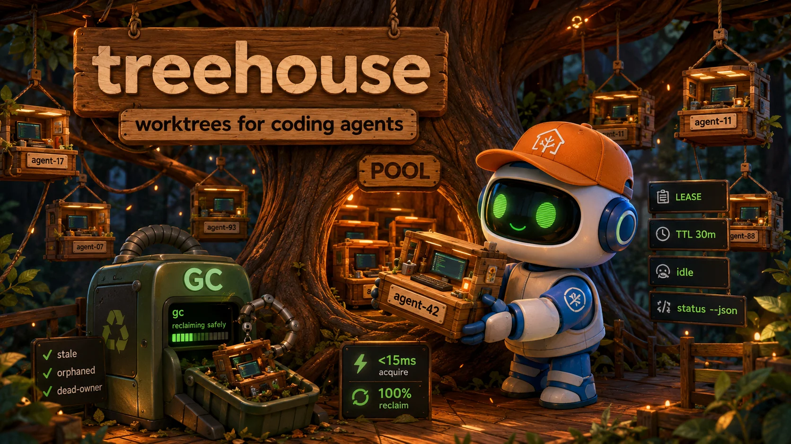

# treehouse — Worktrees for coding agents

<div align="center">
  
</div>

<div align="center">


</div>

**Spin up an isolated git worktree per agent task, then reclaim it automatically when the task ends — never lose a worktree to a crashed agent again.**

treehouse is a Rust reimplementation of [kunchenguid/treehouse](https://github.com/kunchenguid/treehouse) with agent-first upgrades: machine-readable output (`--format json | toon`), durable leases with TTLs, `treehouse gc` to sweep stale worktrees, `treehouse doctor` for diagnostics, and `treehouse run -- <cmd>` that guarantees cleanup on every exit path. It manages a pool of reusable worktrees so agents get isolated environments instantly — with dependencies and build cache intact.

<div align="center">

```bash
# macOS / Linux
curl -fsSL "https://raw.githubusercontent.com/quangdang46/treehouse_rust/main/install.sh?$(date +%s)" | sh
```

```powershell
# Windows PowerShell
irm "https://raw.githubusercontent.com/quangdang46/treehouse_rust/main/install.ps1" | iex
```

</div>

---

## 🤖 Agent Quickstart

treehouse is built for coding agents and the orchestrators that spawn them. If you are an agent or a script driving agents, **always use `--format json` (or `--format toon`) — never the interactive subshell.**

**Output contract**

| Stream | Contents |
|--------|----------|
| `stdout` | Data only: worktree path, JSON, or TOON |
| `stderr` | 🌳 human banners, warnings, prompts |
| `exit 0` | Success |
| `exit 1` | Error — the message is printed once to `stderr` |
| `exit 3` | A dirty worktree was left unreturned |

### Exit code 3

When a worktree has uncommitted changes and you do not pass `--force`, treehouse
leaves it exactly as it found it. Go v3.0.0 made that case exit `3` instead of
`0`, as a **breaking change**: a caller reading `exit 0` as "the slot was
released" was reading a bug. treehouse now matches Go.

```bash
treehouse return "$PATH" < /dev/null
# exit 3 + "worktree not returned ... prune will not reclaim this slot"
```

If you have scripts running under `set -e` that predate the flip, opt out for one
minor release:

```bash
TREEHOUSE_EXIT_STRICT=0 treehouse return "$PATH"
# exit 0 + "Aborted."
```

Only an explicit falsy value opts out (`0`, `false`, `off`, `n`, `no`, `f`).
Anything else — including a leftover `TREEHOUSE_EXIT_STRICT=1` from the old
opt-in era, and an unparseable value — keeps the `3`. A typo must never
silently downgrade to "the slot was released".

The two codes demand different responses: `1` is worth retrying, `3` means the
tree stays dirty until someone cleans it or passes `--force`.

```bash
# 1) Durable lease — path-only on stdout, nothing else
PATH=$(treehouse get --lease --ttl 30m --lease-holder agent-42)

# 2) Or the full allocation as JSON
ALLOC=$(treehouse get --lease --ttl 30m --lease-holder agent-42 --json)
# {"path":"/home/you/.treehouse/acme-3f2a1b/1/acme","lease_id":"9f2c…c6d7","lease_holder":"agent-42","leased_at":"2026-08-14T19:34:56.123456789Z"}

# 3) Run your agent inside it; cleanup is guaranteed on EVERY exit path
treehouse run -- claude -p "implement the pagination fix" "$PATH"

# 4) Or work directly and return explicitly — conditioned on your lease id
cd "$PATH"
# ... code, test, git commit ...
treehouse return --force --if-lease-id "$(jq -r .lease_id <<<"$ALLOC")" "$PATH"

# 5) Pool status for orchestrators
treehouse status --json
# [{"name":"1","path":"…","status":"available","lease_id":"","lease_holder":"","leased_at":null,"processes":[]}]
```

**Why this matters:** if your agent crashes, forgets to return, or gets SIGKILLed, the TTL lease expires and a later `treehouse gc --all --yes` reclaims the worktree *only if it is idle, clean, and merged*. A live agent is never evicted. No more 20 orphaned worktrees on your disk.

Agent instructions (storage, flags, gotchas) are in the sections below:
[Commands](#commands), [Output formats](#output-formats), [Agent workflows](#agent-workflows),
and [Limitations](#limitations).

---

## TL;DR

### The Problem

- **Crashed agents leak worktrees.** Your subagent `git worktree add`s a tree, dies mid-task, and never removes it. Twenty agents later your disk is full and you're hunting orphaned trees by hand.
- **Every agent starts cold.** A fresh `git worktree add` means re-installing dependencies and rebuilding caches every single task.
- **No coordination.** Two agents on the same tree clobber each other; nothing knows a tree is in use.

### The Solution

**treehouse** keeps a **pool of reusable, isolated git worktrees** per repository. Each `get` hands an agent a clean, detached-HEAD worktree in milliseconds — reuse if one is idle, create if not. When the agent finishes (or dies), the tree is reset and returned to the pool with its dependencies and build cache intact. `treehouse gc` sweeps what agents abandoned.

```bash
cd myproject
treehouse          # get a worktree, drop into a subshell
# …agent works…
exit               # worktree is reset and returned to the pool
```

### Why treehouse?

| Feature | What it does |
|---------|--------------|
| **Reusable pool** | Worktrees are preserved, not deleted, so `node_modules` / `target` / build cache stay warm |
| **Detached HEAD** | Reset to the latest default branch every acquisition — no branch-name conflicts between agents |
| **In-use detection** | Scans processes + owner reservations; a tree in use is never handed out |
| **Durable leases** | `get --lease` reserves a tree with a random 128-bit identity that survives zero processes |
| **TTL leases** | `--ttl 30m` makes the lease self-expiring — a crashed agent can't hold a tree forever |
| **Safe `gc`** | Reclaims stale, orphaned, and dead-owner trees; dry-run by default; a valid lease is never touched |
| **Cleanup-always `run`** | `treehouse run -- <cmd>` returns the tree on every exit path, including signals |
| **Machine-readable** | `--format json` / `--format toon` on every agent-facing command |
| **`doctor`** | 12 read-only health checks; answers "why is this worktree still here?" |
| **Safe destruction** | `destroy` and `prune` share one classifier; each risk class is its own opt-in flag |

### How treehouse compares

| Capability | treehouse | Raw `git worktree` | Manual clones |
|-----------|-----------|--------------------|----------------|
| Isolated environment per agent | ✅ | ✅ | ✅ |
| Worktree pooling & reuse | ✅ | ❌ | ❌ |
| Keeps deps / build cache across tasks | ✅ | Manual | ❌ |
| In-use detection (conflict-free) | ✅ | ❌ | ❌ |
| Durable lease (survives zero processes) | ✅ | ❌ | ❌ |
| Crash / stale-tree cleanup | ✅ `gc` | `git worktree prune` (low-level) | ❌ |
| Machine-readable output for agents | ✅ `--format json` / `--format toon` | ❌ | ❌ |
| Automatic `return` on any exit | ✅ `run` | ❌ | ❌ |
| Safe dry-run destruction | ✅ | ❌ | ❌ |

---

## Quick Start

```bash
# 1. Install
# macOS / Linux
curl -fsSL "https://raw.githubusercontent.com/quangdang46/treehouse_rust/main/install.sh" | sh
# Windows PowerShell
irm "https://raw.githubusercontent.com/quangdang46/treehouse_rust/main/install.ps1" | iex
# or from source / via cargo (any platform)
# `--features toon` is required: without it `--format toon` falls back to JSON.
cargo install --git https://github.com/quangdang46/treehouse_rust --tag v0.2.0 --features toon treehouse

# 2. From inside a repo, get a worktree and a subshell
cd myproject
treehouse
# 🌳 Entered worktree at ~/.treehouse/myproject-3f2a1b/1/myproject. Type 'exit' to return.

# 3. Agent works here (isolated, dependencies already warm)
npm install   # first time only — cached for the next agent
# …work…

# 4. exit → worktree is cleaned and returned to the pool
exit
# 🌳 Terminated lingering processes: opencode (12345)
# 🌳 Worktree returned to pool.
```

---

## Quick Navigation

[Commands](#commands) · [Output formats](#output-formats) · [Agent workflows](#agent-workflows) · [Configuration](#configuration) · [Architecture](#architecture) · [Design principles](#design-principles) · [Troubleshooting](#troubleshooting) · [Limitations](#limitations) · [FAQ](#faq) · [Development](#development)

---

## Commands

| Command | Description |
|---------|-------------|
| `treehouse` | Alias for `get` — acquire a worktree and open a subshell |
| `treehouse get` | Acquire a worktree from the pool |
| `treehouse get --lease` | Durably lease a worktree without a subshell; print its path |
| `treehouse enter <name>` | Attach to an existing worktree by name (from `status`), even if in use |
| `treehouse return [path\|name]` | Release a lease, terminate lingering processes, reset, return to pool |
| `treehouse return --all` | Return every worktree this repository holds; slots nobody holds are left alone |
| `treehouse lease <name>` | Durably lease an existing worktree by name, without touching its contents |
| `treehouse status` | Show pool status (highlights leased and current worktrees) |
| `treehouse prune` | Dry-run removal of stale idle worktrees |
| `treehouse gc` | Reclaim stale, orphaned, and dead-owner worktrees (dry-run default) |
| `treehouse destroy <path>` | Dry-run removal of one worktree (`--yes` to execute) |
| `treehouse watch` | Sweep all pools on a schedule — `--once` for cron/systemd, `--interval` for foreground loop |
| `treehouse doctor` | Read-only health report |
| `treehouse run -- <cmd…>` | Acquire → run an agent → cleanup guaranteed on every exit |
| `treehouse init` | Create a default `treehouse.toml` |
| `treehouse update` | Update treehouse to the latest release |

### `get`

| Flag | Description |
|------|-------------|
| `--lease` | Durably lease instead of opening a subshell; path-only on stdout |
| `--lease-holder <label>` | Record who holds the lease (defaults to `$TREEHOUSE_LEASE_HOLDER`) |
| `--ttl <duration>` | Make the lease expire (e.g. `30m`, `1h30m`, `24h`); requires `--lease` |
| `--json` | Print `path`, `lease_id`, `lease_holder`, `leased_at` as JSON; requires `--lease`. These four fields are the whole payload — the TTL is not echoed back, so an agent that needs the expiry must compute it from `leased_at` and the `--ttl` it passed |
| `--base <branch>` | Cut from this branch instead of the repository default (does **not** create the branch) |
| `-b`, `--branch <name>` | Create and check out this **new** branch at the acquired commit. Distinct from `--base`, which only changes where the worktree is cut *from*. Fails if the branch already exists |
| `--no-fetch` | Skip the `git fetch origin` that normally runs before acquiring (offline / air-gapped) |
| `--unique-leaf` | Name a newly created worktree directory `<repo>-<slot>` instead of `<repo>`. Defaults to `$TREEHOUSE_UNIQUE_LEAF` |
| `--worktree-path <template>` | Template for a newly created worktree's directory, e.g. `{pool}/{slot}/{repo}`. Supported placeholders: `{pool}`, `{slot}`, `{repo}`, `{repo_parent}`. Overrides `--unique-leaf`. Defaults to `$TREEHOUSE_WORKTREE_PATH` |
| `--include-file <FILE>` | Replace the committed `.worktreeinclude` with this file for **this** acquisition. An empty file seeds nothing — it does not fall back to the committed manifest |
| `--apfs-sharing <off\|fresh>` | On macOS/APFS, share tracked file data with the source checkout instead of copying it. Defaults to `$TREEHOUSE_APFS_SHARING`, then `off`. Never fails an acquisition — see [Limitations](#limitations) for the symlinked-pool-root case |

Every flag above applies to **both** acquisition modes — `get` and `get --lease`
route through one option set, so nothing is silently dropped by `--lease`.

#### Backend selection (`jj`)

The backend is chosen per repository, and **git is the default**. A `.jj`
directory alone does not select jj; jj must be opted into explicitly, and the
environment variable is the **only** way to opt in:

```
TREEHOUSE_VCS=jj  >  git
```

There is no `vcs` key in `treehouse.toml` or `~/.config/treehouse/config.toml` —
the config type has no such field, so writing one is silently ignored rather than
honoured. (See [Limitations](#limitations).)

`--branch` and `-b` create a *git* branch, so they are **refused** against a jj
workspace rather than silently ignored — but only once the repository root
resolves, which today means the checkout has to be readable by git:

```console
$ TREEHOUSE_VCS=jj treehouse get -b feat/x     # in a checkout git can resolve
--branch is only supported by the git backend (cannot create "feat/x" in a jj workspace)
```

In a `.jj`-**only** directory the root never resolves, so the git error below
happens first and you never reach the branch check. See the status note.

> **Status of the jj backend, plainly.** It is implemented and registered —
> `vcs/jj.rs` implements 21 of the `GitBackend` trait's 24 methods — but it has
> **never been run against a real jj repository.** All of its test coverage is
> unit tests against a faked command layer, so jj's own output formats are
> unverified here. Three concrete gaps:
>
> - Only the `TREEHOUSE_VCS` tier is honoured. `vcs = "jj"` in either config
>   file needs a `vcs` field on the config layer, which does not exist.
> - Worktree **creation** does not go through the seam — it calls
>   `git.worktree_add` directly. The pool also resolves its repository root
>   through git, so in a `.jj`-only directory `TREEHOUSE_VCS=jj treehouse get
>   --lease` currently exits 1 with
>   `git git rev-parse --show-toplevel: fatal: not a git repository` before
>   creation is ever reached. It fails closed; the exact string is changing as
>   root resolution moves behind the seam, so don't script against it.
> - `.worktreeinclude` seeding is not implemented for jj; those two trait
>   methods keep the refusing default.
>
> A missing `jj` binary is reported as itself: `jj binary not found on PATH
> (set JJ_BIN)`, not as a configuration error.

### `status`

| Flag | Description |
|------|-------------|
| `--json` | Print status + lease metadata as JSON (`lease_id`/`lease_holder` are `""` when not leased; `leased_at` is `null`) |

### `return`

The argument is read as a path first and then as a slot name, so `treehouse return 3`
does the obvious thing from inside the repo. It defaults to `$TREEHOUSE_DIR`.

| Flag | Description |
|------|-------------|
| `--force` | Clean, reset, and return without prompting |
| `--all` | Return every worktree held for this repository; slots nobody holds are left alone |
| `--if-lease-id <id>` | Return only if the current lease has this identity (ABA-safe) |
| `--if-lease-holder <holder>` | Return only if the current lease has this holder |

### `lease`

Durably lease a worktree **by name** without touching its contents — the counterpart
to `get --lease` for a slot that already exists.

| Flag | Description |
|------|-------------|
| `--lease-holder <label>` | Record who holds the lease (defaults to `$TREEHOUSE_LEASE_HOLDER`) |
| `--json` | Print the lease identity as JSON instead of the bare path |

```bash
treehouse lease 3 --lease-holder agent-42
treehouse lease 3 --lease-holder agent-42 --json
```

### `prune` / `gc`

| Flag | Description |
|------|-------------|
| `--yes` | Execute instead of dry-run |
| `--all` / `--global` | Sweep every managed pool under the user-level root, from anywhere |
| `--prune-orphans` | Include backing-repository-missing orphans |
| `--verbose` / `-v` | Show detailed skip diagnostics |

### `destroy`

| Flag | Description |
|------|-------------|
| `--all` | Remove all worktrees in the named pool (requires a pool path) |
| `--yes` | Execute instead of dry-run |
| `--include-unlanded` | Also remove dirty, unmerged, or unverified worktrees (data loss) |
| `--include-in-use` | Also remove worktrees with a running process (terminated first) |
| `--include-leased` | Also remove a leased worktree — single named path only, never `--all` |

### Global flag

| Flag | Description |
|------|-------------|
| `--root <DIR>` | Custom pool root; available on every command. Aliased as `--env-path`. |
| `TREEHOUSE_ROOT` | Same thing, from the environment |
| `TREEHOUSE_EXIT_STRICT=0` | Opt **out** of the default exit `3` on an unreturned dirty worktree; restores exit `0`. See [Exit code 3](#exit-code-3) |
| `TREEHOUSE_VCS=jj` | Select the jj backend for this repository. Git is the default |

Precedence, highest first:

```
--root <DIR>  >  TREEHOUSE_ROOT  >  treehouse.toml `root`  >  ~/.treehouse
```

> **`--root` and `--env-path` are the same flag**, and the directory you name is
> the **parent** of the pool, not the pool itself — Go's `--root` semantics. So
> `treehouse --root /tmp/pools get` puts the worktree in
> `/tmp/pools/.treehouse/<repo>-<hash>/`, not in `/tmp/pools/`. Use an absolute
> path; a relative one (including `.`) resolves from the repository root, which
> is how an in-project pool at `<repo>/.treehouse` is configured.
>
> This is a behaviour change from v0.1.2 and earlier, where `--env-path` was a
> silent no-op that always fell back to `~/.treehouse`. If you were relying on
> the old flag, it now works — and the pool it selects is the one above.

### `doctor`

| Flag | Description |
|------|-------------|
| `--format human|json|toon` | Output format (default `human`) |
| `--strict` | Treat any warning as a failure |

### `watch` — auto-clean sweeper

Sweeps every pool under `~/.treehouse` — designed to run from your OS scheduler (systemd, launchd, Task Scheduler, or cron). See [docs/watch-deployment.md](docs/watch-deployment.md) for full setup recipes.

| Flag | Description |
|------|-------------|
| `--once` | Run a single sweep and exit (cron/systemd one-shot) |
| `--interval <dur>` | Sweep interval for the foreground loop (e.g. `30s`, `5m`, `1h`). Default: `60s`. Ignored when `--once` is set |
| `--yes` | Execute instead of dry-run |
| `--prune-orphans` | Include backing-repository-missing orphans |
| `--root <DIR>` | Custom pool root (see [Global flag](#global-flag)); aliased as `--env-path` |

```bash
# One-shot — ideal for cron / systemd timer
treehouse watch --once --yes

# Foreground loop — runs forever, sweeps every 30s
treehouse watch --interval 30s --yes

# Dry-run first (default)
treehouse watch --once
```

### `run`

```bash
treehouse run -- claude -p "fix the flaky test"
# acquires a TTL lease, spawns the command in the worktree, and on ANY exit
# (0, nonzero, signal, panic) resets the tree and returns it to the pool.
# Exit code = the command's exit code. treehouse run -- false → 1; -- true → 0.
```

---

## Output formats

Every agent-facing command accepts `--format human | json | toon`. `human` is the default; `--json` on `get`/`status` is a shorthand for `--format json`.

```bash
treehouse status --format json
treehouse status --format toon
treehouse status --format human   # default
```

**JSON** — compact, one document per command, trailing newline. Fields are always present:

```json
[{"name":"1","path":"/home/you/.treehouse/acme-3f2a1b/1/acme","status":"available","lease_id":"","lease_holder":"","leased_at":null,"processes":[]}]
```

**TOON** — the same data, in a list-shaped encoding for LLM context:

```
[1]:
  - name: "1"
    path: /home/you/.treehouse/acme-3f2a1b/1/acme
    status: leased
    lease_id: f0b318a86692af4e4cddd732ebca0941
    lease_holder: ""
    leased_at: "2026-10-01T16:33:44.985070+00:00"
    processes[0]:
```

Quoting is the encoder's, not yours — a value is quoted when unquoted would be
ambiguous, so `processes[0]:` is an empty list rendered by key, not a slice.

`human` keeps the 🌳 banners on `stderr` and the table on `stdout`, so scripts that capture `stdout` are safe in every mode.

The TOON encoder is behind the opt-in `toon` feature and is enabled in the release build, so every binary you download emits the output above. A binary you build yourself needs `cargo build --features toon` (see [Development](#development)); without it `--format toon` still succeeds but prints JSON.

---

## Agent workflows

### The core loop — never leak a worktree

```bash
# Orchestrator: hand each agent a TTL-bounded, identifiable worktree
alloc=$(treehouse get --lease --ttl 30m --lease-holder agent-42 --json)
path=$(jq -r .path <<<"$alloc")
lease=$(jq -r .lease_id <<<"$alloc")

# Agent returns it explicitly when done…
treehouse return --force --if-lease-id "$lease" "$path"

# …or dies. After 30m the lease is stale, and a sweep reclaims it if safe:
treehouse gc --all --yes     # cron: daily
treehouse doctor --json      # see exactly why anything is still held
```

### `treehouse run` — cleanup guaranteed

`run` is the "I never want to see an orphaned worktree again" command. It acquires a TTL lease, spawns the agent in the tree, and runs cleanup on **every** exit path. Even if `treehouse` itself is SIGKILLed, the TTL lease self-expires and a later `gc` sweep reclaims the tree — while the in-use process check prevents evicting a still-running agent.

### Attach to a worktree another agent is using

```bash
treehouse enter --print-path 3    # just the path, for cd "$(...)"
treehouse enter 3                 # drop into a subshell; pool state untouched
```

---

## Configuration

Repo-level: `treehouse.toml` in the repository root.
User-level: `~/.config/treehouse/config.toml`.

```toml
# Maximum number of worktrees in the pool
max_trees = 16

# Optional worktree root directory.
# Empty uses $HOME/.treehouse.
# root = "$HOME/worktrees"
```

Repo config takes precedence for repo-safe settings. Hooks are **user-level only** (repo hooks are ignored for safety):

```toml
[hooks]
post_create = ["./scripts/setup-venv.sh"]   # after a worktree is provisioned/reset
pre_destroy = ["./scripts/teardown.sh"]     # before a worktree is removed
```

Hooks run sequentially in the worktree directory via the OS shell (`/bin/sh -c` on unix, `%COMSPEC% /d /s /c` on Windows). A failing hook is logged but never fails the enclosing operation.

---

## 📚 Library Usage

treehouse-core can be embedded as a library with **zero dot-folders, zero config files, zero env vars**. The `TreehouseEnv` trait abstracts all filesystem side-effects.

### Quick start (DefaultEnv — identical to CLI)

```rust
use treehouse_core::TreehouseCore;
use std::path::Path;

let core = TreehouseCore::open(Path::new("."))?;
```

### Custom environment

```rust
use treehouse_core::TreehouseCore;
use treehouse_core::config::TreehouseConfig;
use treehouse_core::env::TreehouseEnv;
use std::path::{Path, PathBuf};

struct MyEnv { base: PathBuf }

impl TreehouseEnv for MyEnv {
    fn pool_root(&self) -> Option<PathBuf> {
        Some(self.base.join("pools"))
    }
    // ... implement other methods
}

let env = MyEnv { base: PathBuf::from("/tmp/my-app") };
let config = TreehouseConfig { max_trees: 4, ..Default::default() };
let core = TreehouseCore::with_env(env, config);

// Zero .treehouse directory created!
```

### Zero-filesystem testing

```rust
use treehouse_core::TreehouseCore;
use treehouse_core::env::InMemoryEnv;
use std::path::PathBuf;

let core = TreehouseCore::for_test(PathBuf::from("/test/pools"));
```

See `crates/treehouse-core/examples/` for runnable examples.

---

## Architecture

treehouse is a **no-daemon CLI** — every operation is an inline command; state is a small on-disk file guarded by a file lock.

```
 treehouse
     │  find repo root → git fetch origin
     ▼
 ┌──────────────────────────────┐
 │  Scan pool for an idle tree  │  (not leased, not in-use, not dirty)
 └──────┬───────────────┬───────┘
    found│            none│
        ▼                ▼
 Reset to latest      Create new worktree
 default branch       (detached HEAD)
        └───────┬───────┘
                ▼
        Spawn subshell / lease
        (agent works)
                │
                ▼
        exit / return / run-cleanup
        ─────────────────────────
        Terminate lingering processes
        Reset worktree
        Return to pool
```

```
~/.treehouse/
└── <repo>-<hash>/              # one pool per repository (hash = sha256 of remote URL)
    ├── treehouse-state.json    # pool state — written atomically
    ├── treehouse-state.lock    # file lock (flock / LockFileEx)
    ├── 1/<repo>/               # reusable worktrees, numbered
    ├── 2/<repo>
    └── …
```

**Ownership is three independent facts**, never inferred from each other:

| Fact | Detected by | Self-heals? |
|------|-------------|-------------|
| Live process | process scan (cwd inside tree) | — |
| Owner reservation | `owner_pid` + `owner_started_at` | Yes — cleared when the owner dies (PID-reuse safe) |
| Durable lease | `leased` + `lease_id` + `lease_holder` | **No** — only `return` or an explicit destroy clears it |

A lease survives with zero running processes; it is never cleared by the self-healing sweep, never handed out by `get`, and never removed by `prune` or bulk `destroy --all`. That conservatism is what makes crash recovery safe.

**Safe destruction is two-phase:** reserve the tree under the lock → run `pre_destroy` hooks outside it → re-verify the reservation under a fresh lock → delete. A tree re-acquired mid-hook is never deleted.

**State is crash-safe:** written via temp-file + fsync + atomic rename (Windows: `MoveFileExW`). A truncated state file is recovered conservatively — every on-disk tree is marked `leased` until a human verifies with `status` + `return`.

---

## Design principles

| Principle | Rationale |
|-----------|-----------|
| **No silent data loss** | A tree is only recyclable when it's provably idle, clean, merged, and unleased |
| **Safe by default** | `prune`, `gc`, and `destroy` are dry-runs; each risk class is its own opt-in flag |
| **Conservative recovery** | After a crash or corrupt state, trees are quarantined as `leased` until a human verifies |
| **Leases are not processes** | Ownership is three distinct facts; never inferred from one another |
| **Machine output is a contract** | `stdout` = data, `stderr` = diagnostics, exit codes are honest |
| **Portable** | Linux, macOS, Windows — git is invoked directly, no shell-quoting traps |
| **No daemon** | Inline commands; the state file + lock is the whole coordination story |

---

## Troubleshooting

| Symptom | Cause | Fix |
|---------|-------|-----|
| `all 16 worktrees are in use or dirty` | Pool exhausted | `treehouse status` to see why; `treehouse gc --all --yes` to reclaim stale trees; raise `max_trees` |
| `lease precondition failed: lease identity does not match` | Returned with a stale `--if-lease-id` | Re-fetch the current lease from `status --json`, then `return --if-lease-id` with the fresh id |
| `worktree <path> is not managed by treehouse` | Path isn't in a pool | Confirm it was created by `treehouse get` |
| `worktree <path> is being destroyed` | A concurrent destroy is in progress | Wait and retry |
| Tree shows `leased` but no agent is running | Crashed agent left a lease | `treehouse return --force <path>` (or `destroy <path> --include-leased --yes`), or wait for the TTL + `gc` |
| `corrupt or truncated` warning on stderr | State file damaged mid-write | Read it as designed: trees are marked `leased`; run `status`, verify, then `return` each |
| `origin unreachable (cannot verify)` on prune | Can't reach the remote | Prune refuses to delete unverifiable trees; fix network, re-run |
| Update not applied | Binary dir not writable | Re-run `treehouse update` with write access to the install dir |

---

## Limitations

- **Not a security sandbox.** treehouse isolates working directories and lifecycle ownership — it does not contain untrusted code.
- **Not a branch manager.** It coordinates *environments*, not merges/PRs; git remains the source of truth for collaboration.
- **Cooperative consumers only.** The reservation + lock coordinate *treehouse* consumers; a bare `cd` into a worktree during a reset isn't detected (same as the Go original).
- **Windows termination is abrupt.** There is no graceful SIGTERM on Windows; processes are terminated via `TerminateProcess`.
- **TTL + a live agent:** a long-running agent past its TTL is never evicted (the in-use check protects it); only *idle* stale trees are reclaimed.
- **Recovered-from-corrupt trees hold disk until verified** — deliberate conservatism.
- **APFS sharing needs a non-symlinked pool root, and on macOS the obvious ones are symlinked.** `--apfs-sharing fresh` opens the destination with `O_NOFOLLOW` on every path component, so a symlink between the pool root and the slot is a skip. `/tmp` and `/var` are symlinks to `/private`, which means `--root "$TMPDIR/..."` skips on the default macOS temp directory. Reproduced on one repo and volume:

  ```console
  --root "$TMPDIR/pool"          # APFS sharing skipped: destination path unavailable
                                  #   or symlinked: Not a directory (os error 20)
  --root "$(cd "$TMPDIR" && pwd -P)/pool"
                                  # APFS sharing: cloned=1 logical_bytes=200000
                                  #   private_data_reduced_bytes=200704 below_threshold=1
  ```

  The refusal is deliberate — a slot must not be redirectable — but it is silent, so it reads as a broken feature. Pass a canonical path if you want sharing.
- **jj is implemented but unproven.** The backend is registered and implements 21 of 24 trait methods, but no test in this repository has run it against a real jj binary, and worktree creation plus the pool's repository-root resolution still go through git. A `.jj`-only checkout therefore fails closed rather than operating. See [Backend selection (`jj`)](#backend-selection-jj).
- **`toon` is not smaller than `json` here.** Measured on a real `status` payload, `toon` came out larger. `--format json` is the default recommendation.

---

## FAQ

### Does it replace `git worktree`?
No — it manages `git worktree` for you. The pool, leases, in-use detection, and cleanup are what treehouse adds on top.

### Can agents use it without an interactive subshell?
Yes. Prefer `treehouse get --lease --json`, `treehouse status --json`, and `treehouse run -- <cmd>` — all machine-readable, all non-interactive.

### What happens if my agent crashes?
The TTL lease (if set) expires; a later `treehouse gc --all --yes` reclaims the tree *if* it is idle, clean, and merged. Without a TTL, the lease persists until you `return` or `destroy --include-leased` it — never silently recycled.

### Why does a leased tree show as `leased` even with no process inside?
That's the point of a durable lease: it survives zero processes. It's a reservation, not a process snapshot.

### Does the pool reuse dependencies / build cache?
Yes. Trees are returned to the pool, not deleted, so `node_modules`, `target/`, and other caches survive across tasks. `gc` is the only thing that reclaims the disk.

### How is a stale worktree different from an orphan?
**Stale** = treehouse manages it, it's idle, and its HEAD is merged — safe to reclaim. **Orphan** = the backing repository's git metadata is gone; treehouse can't verify its contents, so it's only removed with an explicit `--prune-orphans --yes`.

### Which output format should my orchestrator use?
`--format json`. It is the format to benchmark against: on real `status` payloads
`toon` rendered *larger* than JSON — 291 B vs 275 B for one slot on one pool,
335 B vs 319 B on another with longer paths. The absolute counts scale with pool
path length, but the direction held on every fixture measured (~16 bytes the
worse), so the usual "TOON is 40–60% smaller" folklore does not hold here. Reach
for `--format toon` only after measuring your own payload and seeing it win.

---

## Development

```sh
cargo build --workspace    # build both crates
cargo test --workspace     # unit + integration tests (real git worktrees)
cargo clippy --all-targets # lint
cargo fmt --check          # formatting
```

The TOON encoder (`--format toon`) lives behind an opt-in `toon` feature, because it
pulls a pinned git dependency and a default-features build should still work offline.
It is **enabled in the release build**, so every binary downloaded from a GitHub
release emits real TOON; anything you build yourself has to ask for it:

```sh
cargo build --bin treehouse --features toon
cargo test  --bin treehouse --features toon
```

Without the feature the CLI still runs `--format toon`, but prints JSON. See
[docs/toon-dependency-verification.md](docs/toon-dependency-verification.md) for what
was pinned and why.

This is a Rust port of [kunchenguid/treehouse](https://github.com/kunchenguid/treehouse). The gap audit in [CHANGELOG.md](CHANGELOG.md) is against upstream **v3.1.0**; the behavioral reference for the pool/state/lease core is earlier Go (v2.x). The workspace is two crates: `crates/treehouse` (CLI) and `crates/treehouse-core` (the pool/state/git/process library). The port plan is in [docs/rust-port-plan.md](docs/rust-port-plan.md); implementation is tracked as dependency-linked beads (see `.beads/`).

---

<div align="center">
  <sub>Built for operators and coding agents who live in the terminal.</sub>
</div>
